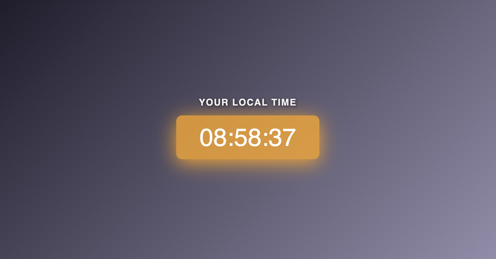

# 🔗 Live Demo: https://digital-clock-virid-kappa.vercel.app/

# Digital Clock

A simple Digital Clock application that displays the current local time in real-time. Built using HTML, CSS, and JavaScript.

## Preview



## Features

- Displays the current local time dynamically.
- Updates the time every second.
- Minimal and clean design.

## Project Structure

```
Digital Clock/
├── index.html       # Main HTML file
├── style.css        # Styling for the clock
├── script.js        # JavaScript functionality
```

## How to Use

1. Open the `index.html` file in any modern web browser.
2. The clock will automatically display your local time and update every second.


## Technologies Used

- **HTML**: For the structure of the app.
- **CSS**: For styling the clock.
- **JavaScript**: For real-time functionality.

## How to Run Locally

1. Clone this repository or download the project files.
2. Open the `index.html` file in your browser.

## Future Enhancements

- Add support for multiple time zones.
- Include a toggle for 12-hour and 24-hour formats.
- Add a dark mode option.

## License

This project is open-source and available under the [MIT License](LICENSE).
